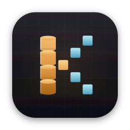
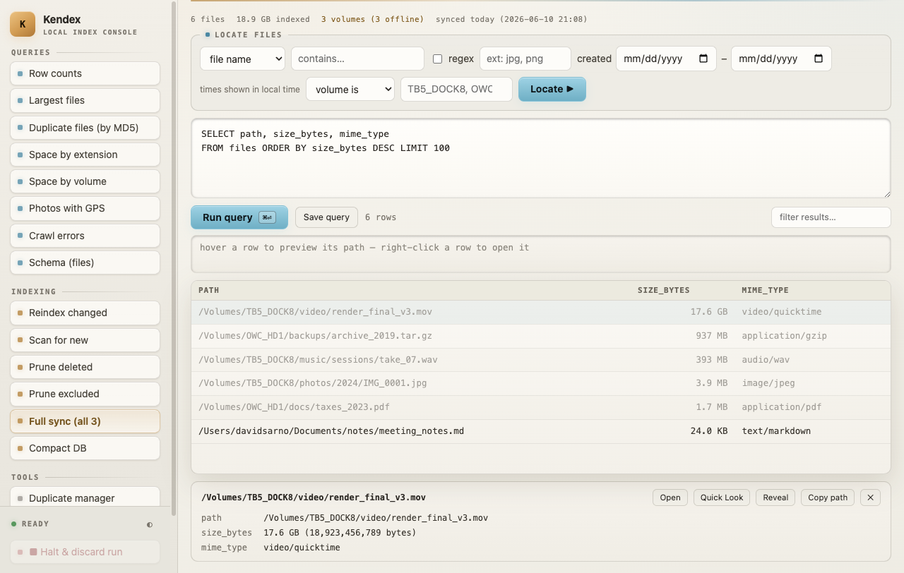
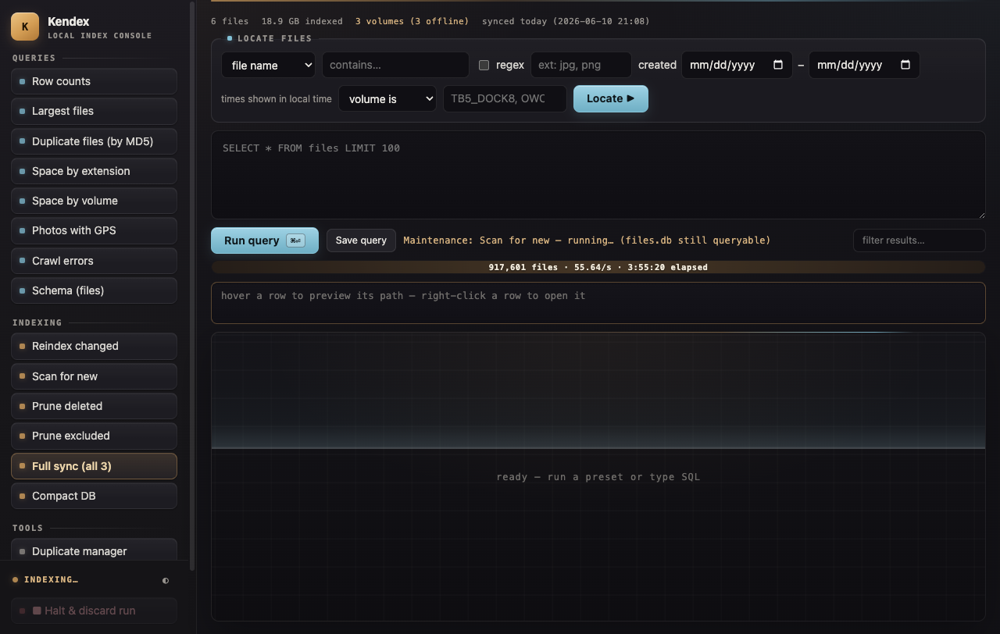
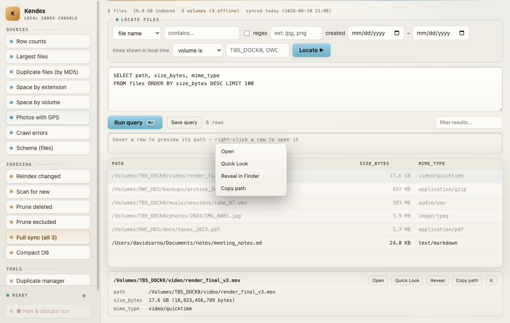
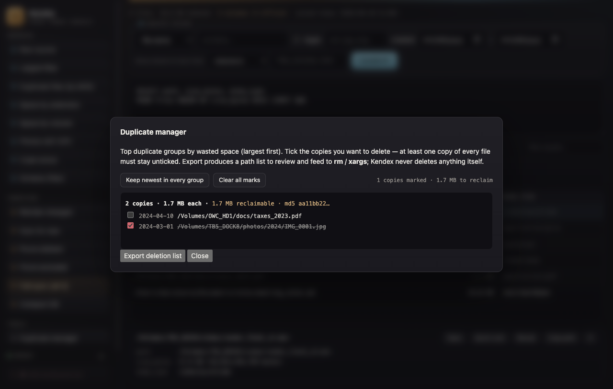

<p align="center">
  
</p>

<h1 align="center">Kendex</h1>

<p align="center"><b>A local file-index console for macOS.</b><br>
It walks your drives, records rich metadata (size, MD5, MIME type, EXIF for
photos/videos) for every file into a DuckDB database, and gives you a fast
desktop UI for querying it — including a duplicate-file manager.</p>

Everything runs locally: the index never leaves your machine, queries run
against a read-only connection, and maintenance runs work on a disposable copy
of the database that is swapped in atomically only when a run succeeds — an
in-progress crawl can always be halted and discarded without touching your
current index.

## Screenshots



| A scan in progress | Open from the index | Duplicate manager |
|---|---|---|
|  |  |  |

## The desktop app

The Electron app (`Kendex.app`) starts the Python backend on a free localhost
port and opens it in a native window. It keeps its own database under
`~/Library/Application Support/kendex/files.db`, so it never interferes with a
browser-mode service or another crawl.

### Requirements

**The prebuilt app bundles everything it needs** — its own Python, DuckDB, and
libmagic — so it runs on a clean macOS (Apple Silicon) with **nothing to
install**. Download it, drag it to Applications, and open it.

The tools below are needed only for **running from source** or **browser mode**:

- **macOS** (Apple Silicon for the prebuilt artifacts)
- **[uv](https://docs.astral.sh/uv/)** — manages Python and dependencies:
  `curl -LsSf https://astral.sh/uv/install.sh | sh`
- **libmagic**: `brew install libmagic`
- **exiftool** (optional, for photo/video metadata): `brew install exiftool`

### Run from source

```bash
npm install
npm start
```

### Package a build

```bash
npm run check                           # syntax checks
bash scripts/build-backend-runtime.sh   # bundle Python + deps + libmagic into runtime/
npm run smoke                           # boots the backend through Electron and exits
npm run dist                            # DMG + ZIP in dist/
```

The `build-backend-runtime.sh` step produces `runtime/` — a relocatable CPython,
the Python deps installed flat, and `libmagic` + its database — which
`extraResources` ships into `Contents/Resources/backend/runtime`. That bundle is
why the packaged app needs no uv or Homebrew. It's git-ignored; **CI rebuilds it
automatically before packaging**, so you only run the script by hand for a local
`npm run dist` (uv + `brew install libmagic` are the build-host prerequisites).

Release builds are **Developer-ID signed and notarized** by CI, so they open
without any Gatekeeper warning. A local `npm run dist` signs with whatever
Developer ID is in your keychain (and notarizes only when the `APPLE_API_*`
environment variables are set — see `scripts/notarize.js`); without a
certificate it still builds, just unsigned. Tester install steps, including how
to seed the app with an existing `files.db`, live in
[README-DAD-TESTER.md](README-DAD-TESTER.md).

### Tagged releases (CI)

Pushing a `v*` tag builds, signs, notarizes, and publishes the Apple Silicon
DMG + ZIP to a GitHub Release on a macOS arm64 runner
(`.github/workflows/release.yml`):

```bash
git tag v0.2.5
git push origin v0.2.5
```

The workflow syncs the package version to the tag (so the bump and tag can't
drift) and uploads the `latest-mac.yml` feed alongside the artifacts, which is
what the in-app auto-updater reads. It needs these repository secrets:

| Secret | What it is |
|---|---|
| `MAC_CERT_P12` | base64 of the exported **Developer ID Application** `.p12` |
| `MAC_CERT_PASSWORD` | the password used when exporting that `.p12` |
| `APPLE_API_KEY_P8` | base64 of the App Store Connect API key `.p8` |
| `APPLE_API_KEY_ID` | the API key's Key ID |
| `APPLE_API_ISSUER` | the API key's Issuer ID |
| `APPLE_TEAM_ID` | your 10-character Apple Team ID |

### Auto-update

The installed app checks GitHub Releases on launch and once a day. A new
version downloads in the background and installs the next time you quit
(never mid-scan); **Kendex → Restart & Update Now** applies it immediately, and
**Check for Updates…** runs a manual check. Auto-update only runs in a packaged,
signed build.

The update check reads the public releases feed unauthenticated, so the repo
must be **public** for auto-*checking* to work (it returns 404 while private).
The repo is public, so this works. CI publishes each tagged release as a live
(non-draft) GitHub Release with a `latest-mac.yml` feed; see the release
workflow notes above.

To point the app at a specific database instead of its own:

```bash
FILE_INDEXER_DB="$HOME/FileIndexer/files.db" npm start
```

### What the console gives you

- **Locate form + SQL box** — build a search from name/extension/date/volume
  fields, or write DuckDB SQL directly (Cmd+Enter runs; Cmd+↑/↓ recalls
  history; *Save query* pins your own presets to the sidebar).
- **Readable results** — human-readable sizes, sortable columns, a type-to
  filter, CSV export, and a row inspector with every column of the selected
  file.
- **Open from the index** — right-click any result (or use the inspector):
  Open, Quick Look, Reveal in Finder, Copy path. Space previews the selected
  row; Enter opens it.
- **Duplicate manager** — top duplicate groups by wasted space, each headline
  naming the file. Tick copies and **Move to Trash** (recoverable via Finder
  Put Back — never a permanent delete); you can remove *every* copy of a file
  you don't want, or click a group's headline to select all of it. An *Export
  list* option remains for the scriptable case.
- **Add Files** — one indexing action: a fast metadata sweep finds everything
  new and adds it, then a size-collision hash pass flags duplicates. It writes
  straight to the index and is **safe to halt and resume**. A volume picker
  lets you choose which drives to scan. The app holds off system sleep while
  it runs, and shows live progress (file count + rate, or a true percentage
  when a pass has a known total).
- **iCloud-safe** — dataless/offline iCloud files are indexed from their
  metadata **without downloading them** (reading their bytes would force a
  download); the status strip shows how many were skipped this way.
- **More maintenance** (under the collapsible *Maintenance* section) — reindex
  changed, prune deleted, prune excluded, full sync, and DB compaction, all
  against a disposable copy that's swapped in only on success.
- **Status at a glance** — file count, indexed bytes, volume online/offline
  state, and index age above the form; rows on unmounted volumes are dimmed.
- **Dark and light themes** — follows the system by default; the toggle in the
  sidebar footer remembers your choice.

## Browser mode (headless service)

The same backend can run as a LaunchAgent serving <http://127.0.0.1:8800>:

```bash
./install.sh
```

The installer asks for an install directory and database path, installs
dependencies, and registers the LaunchAgent. The crawler can also be driven
directly from a shell (`FILE_INDEXER_DB` selects the database):

```bash
uv run crawler.py                      # add new files (resumes; skips indexed)
uv run crawler.py --reindex-changed    # refresh changed files
uv run crawler.py --prune              # drop rows for deleted files
uv run crawler.py --prune-excluded     # drop rows now covered by excludes
```

After adding directories to the exclude list, run **Prune excluded** to remove
already-indexed rows under them, then **Compact DB** to reclaim the space.

## Notes

- Timestamps are **stored in UTC** and **displayed in your local time**.
- The backend binds to `127.0.0.1` only and rejects cross-origin requests; the
  query connection is read-only, so queries can never modify the index.
- Exclude lists are path prefixes, one per line, edited in-app (**Edit exclude
  list**); changes apply on the next crawl.

## Uninstall

Desktop app: delete `Kendex.app` and `~/Library/Application Support/kendex/`.

Browser mode:

```bash
launchctl bootout gui/$(id -u)/com.fileindexer.queryapp
rm ~/Library/LaunchAgents/com.fileindexer.queryapp.plist
rm -rf <install-dir>        # also removes the database if it lives there
```
